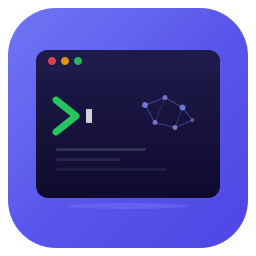

<p align="center">
  
</p>

<h1 align="center">Agent Terminal</h1>

<p align="center">
  AI-powered terminal with ClickUp integration, time tracking, and git worktree support.
</p>

<p align="center">
  <a href="https://github.com/tomdekkpro/Agent-Terminal-releases/releases/latest">
    
  </a>
  <a href="https://github.com/tomdekkpro/Agent-Terminal-releases/releases/latest">
    
  </a>
  
</p>

---


## Features

- **Multi-project terminals** — Organize terminals by project with tabbed navigation and split panes
- **ClickUp integration** — Pick tasks, create branches, track status, and post comments directly from the terminal
- **Time tracking** — Start/stop timer per terminal, automatically synced to ClickUp
- **Git worktree support** — Isolate task work in dedicated worktrees, auto-cleanup on completion
- **Task completion flow** — Create PR, push to remote, or merge locally when done
- **Auto-update** — Get notified and update to the latest version from GitHub Releases
- **Terminal persistence** — Sessions restore automatically on restart
- **Claude AI mode** — Invoke Claude directly in the terminal for AI-assisted development

## Download

Get the latest release for your platform:

| Platform | Download |
|----------|----------|
| Windows | [Agent-Terminal-Setup.exe](https://github.com/tomdekkpro/Agent-Terminal-releases/releases/latest) |
| macOS (Intel) | [Agent-Terminal.dmg](https://github.com/tomdekkpro/Agent-Terminal-releases/releases/latest) |
| macOS (Apple Silicon) | [Agent-Terminal-arm64.dmg](https://github.com/tomdekkpro/Agent-Terminal-releases/releases/latest) |
| Linux (AppImage) | [Agent-Terminal.AppImage](https://github.com/tomdekkpro/Agent-Terminal-releases/releases/latest) |
| Linux (Debian) | [agent-terminal.deb](https://github.com/tomdekkpro/Agent-Terminal-releases/releases/latest) |

## Keyboard Shortcuts

| Action | Shortcut |
|--------|----------|
| Terminals view | `Ctrl+T` |
| ClickUp view | `Ctrl+K` |
| Settings view | `Ctrl+S` |
| New terminal | `Ctrl+N` |
| Switch project 1–9 | `Ctrl+1` – `Ctrl+9` |
| Invoke Claude | `Ctrl+Alt+I` |

## Installation

### Windows
1. Download `Agent-Terminal-Setup-x.x.x.exe`
2. Run the installer
3. Launch from the Start Menu or Desktop shortcut

### macOS
1. Download the `.dmg` for your chip (Intel or Apple Silicon)
2. Open the DMG and drag Agent Terminal to Applications
3. Launch from Applications

### Linux
**AppImage:**
```bash
chmod +x Agent-Terminal-x.x.x.AppImage
./Agent-Terminal-x.x.x.AppImage
```

**Debian/Ubuntu:**
```bash
sudo dpkg -i agent-terminal_x.x.x_amd64.deb
```

## Auto-Update

The app checks for updates automatically on startup. You can also check manually in **Settings > General > Check for Updates**.

## Configuration

### ClickUp

1. Open **Settings** (`Ctrl+S`)
2. Enter your ClickUp API token, Team ID, and List ID
3. Test the connection
4. Tasks will appear in the ClickUp view (`Ctrl+K`)

### Terminal

Customize font family, font size, cursor style, scrollback buffer, and theme in Settings > Terminal.

## Tech Stack

- **Electron 33** — Desktop framework
- **React 19** + **TypeScript 5** — UI
- **Zustand 5** — State management
- **xterm.js 5** — Terminal emulation
- **Tailwind CSS 3** — Styling
- **electron-vite 5** — Build tooling
- **electron-builder 26** — Packaging & distribution
- **electron-updater 6** — Auto-updates

## License

MIT &copy; Tom
